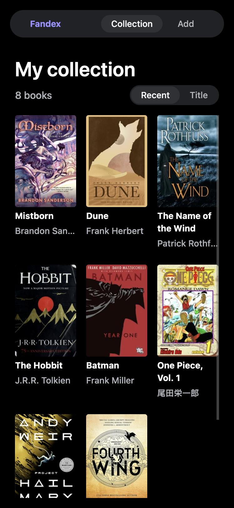
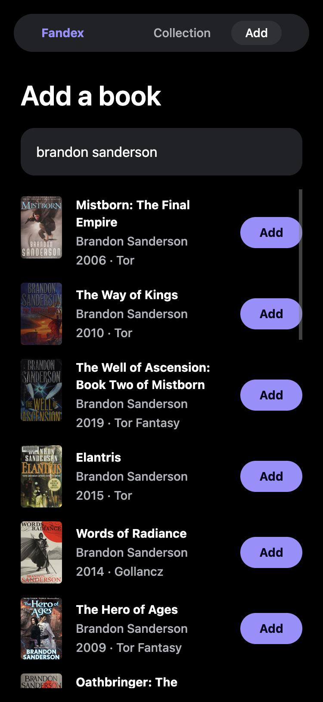
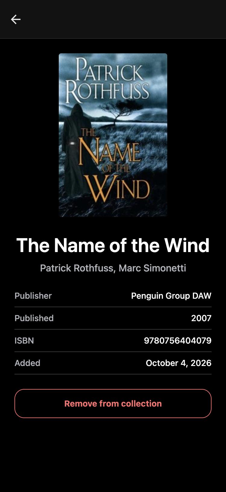
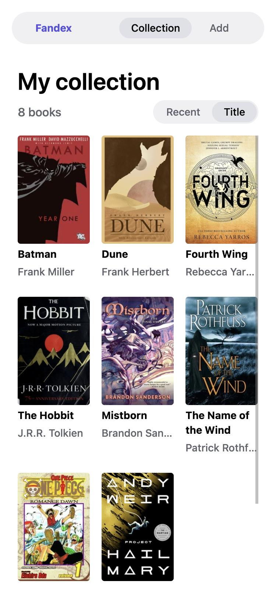
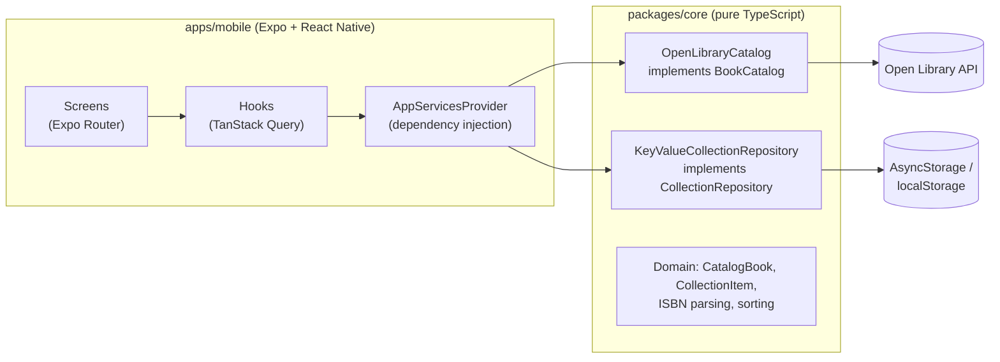

# Fandex

[](https://github.com/sbm2310/fandex/actions/workflows/ci.yml)

**Collect across formats — organized by universe and character.**

Fandex is a collection app for fans who collect comics, manga, fantasy books, premium figures and LEGO. Collector apps today are either single-category (LEGO-only, figures-only) or generic catalogers with blank fields. Fandex is built around how fans actually think about their shelves: _everything I own from Middle-earth, Batman or One Piece_, across every format.

<table>
  <tr>
    <td></td>
    <td></td>
    <td></td>
    <td></td>
  </tr>
  <tr>
    <td align="center">Collection</td>
    <td align="center">Search</td>
    <td align="center">Book detail</td>
    <td align="center">Sorted by title, light mode</td>
  </tr>
</table>

## Status: Stage 1 (v0.1.0)

The MVP runs on iPhone and the web from one codebase:

- **Search** Open Library by title or author as you type, with covers.
- **Look up by ISBN**: type or paste an ISBN-10/13 into the same field for an exact match; typos are caught by the check digit before any request is made.
- **Scan barcodes** with the iPhone camera. Only book barcodes are accepted, so a DVD or toy on the same shelf won't trigger a lookup.
- **Your collection**: a cover grid sorted by recently added or by title (ignoring "The"/"A"), a detail screen per book, and removal with confirmation.
- **Saved on the device** (AsyncStorage on iOS, localStorage on web), surviving restarts.
- Light and dark mode, screen-reader labels, and browser tab titles on web.

Next up is a real backend with accounts and sync (see [Roadmap](#roadmap)).

## Architecture



- **`packages/core`** has no React or platform code: the domain model, ISBN validation, the Open Library adapter and the collection repository. It's tested in plain Node and will be reused by the Stage 2 backend.
- **`apps/mobile`** is the Expo app. Screens get their dependencies (`BookCatalog`, `CollectionRepository`) from a context provider, so tests swap in fakes and Stage 2 can swap local storage for an API without touching the screens.
- **Catalog entries vs. owned copies:** a `CatalogBook` is what a catalog says exists; a `CollectionItem` is the user's copy, with a snapshot of the catalog data so the collection still renders if the source changes or is offline.

### Notable decisions

- **Open Library only.** It's free, keyless and allows browser calls. Google Books was evaluated and rejected: its terms forbid storing results permanently (which a collection does) and charging users without a separate agreement.
- **Cover images by cover ID**, not ISBN: Open Library rate-limits ISBN cover URLs (100 per 5 minutes per IP) but not cover-ID URLs.
- **Ownership is per edition** (matched by ISBN, else by source ID), because collectors care which printing they own.
- **Defensive storage:** versioned JSON documents, serialized writes (rapid taps can't overwrite each other), and unreadable data raises an error instead of being silently replaced.

Full decision log: [`CLAUDE.md`](CLAUDE.md).

## Repository layout

```
apps/
  api/               NestJS API (Stage 2, in progress): PostgreSQL via Prisma, health check, OpenAPI docs
  mobile/            Expo app (Expo Router): iOS, Android and web
    src/app/         Routes: (tabs)/index, (tabs)/add, book/[id], scan
    src/components/  UI components
    src/hooks/       Data hooks (search, collection)
    src/services/    App services and their wiring
packages/
  core/              Domain model, ISBN utilities, Open Library adapter, repository
docs/screenshots/    README images
```

## Getting started

Requirements: Node 24+ (see `.nvmrc`) and npm. For the iPhone, install [Expo Go](https://apps.apple.com/app/expo-go/id982107779).

```bash
npm install
npm run start -w @fandex/mobile
```

- **iPhone:** scan the QR code with the Camera app (phone and computer on the same Wi-Fi).
- **Web:** press `w` in the terminal.

No API keys or environment variables are needed for the app.

### API (Stage 2, in progress)

Requires [Docker Desktop](https://www.docker.com/products/docker-desktop/) for the local PostgreSQL database.

```bash
cp apps/api/.env.example apps/api/.env
npm run db:up                              # start PostgreSQL in Docker
npm run db:deploy -w @fandex/api           # apply database migrations
npm run dev:api                            # API on http://localhost:3000, docs at /docs
```

## Testing

```bash
npm test            # all workspaces
npm run typecheck
npm run lint
npm run format:check
```

167 tests run in CI on every push:

- **`packages/core` (97, Jest + ts-jest):** ISBN validation against reference values, the Open Library adapter against **recorded real API responses** plus edge cases, and the repository (concurrent writes, corrupt data, restarts) over an in-memory store.
- **`apps/api` (19, Vitest + Supertest):** config validation and controllers, plus end-to-end tests against the real Nest app and a real PostgreSQL test database (created and migrated automatically).
- **`apps/mobile` (51, jest-expo + React Native Testing Library):** screens rendered with a fake catalog and the real repository over an in-memory store: search states, ISBN lookup, adding and removing, navigation, sorting, and the barcode scanner with a mocked camera.

Tests never call the network.

## Concepts for .NET developers

This project was built by a C#/.NET developer learning React Native. If that's you too:

| Here                                    | Roughly like in .NET                                 |
| --------------------------------------- | ---------------------------------------------------- |
| npm workspaces (`apps/*`, `packages/*`) | A solution with several projects                     |
| `packages/core` consumed as source      | A class-library project reference                    |
| Expo Router (`src/app/` files = routes) | Razor Pages file-based routing                       |
| `_layout.tsx`                           | `_Layout.cshtml`                                     |
| `AppServicesProvider` + `useCatalog()`  | Registering and resolving services in a DI container |
| TanStack Query                          | A cached `HttpClient` plus state management          |
| `foo.web.ts` next to `foo.ts`           | Conditional compilation per platform                 |
| Metro                                   | The bundler (like webpack)                           |
| EAS Build                               | A cloud CI service for native app binaries           |
| Expo Go                                 | A prebuilt host app that runs your JavaScript bundle |

## Data sources and attribution

Book data and cover images come from [Open Library](https://openlibrary.org), a project of the Internet Archive. The native app identifies itself to the Open Library API (browsers can't set the header), Fandex caches responses, and only makes requests on behalf of a person, per their [API guidelines](https://openlibrary.org/developers/api).

## Roadmap

| Stage                    | Demo at the end                                                                 |
| ------------------------ | ------------------------------------------------------------------------------- |
| **1. MVP** ✅            | Add books by search, ISBN or barcode; collection with covers on iPhone and web  |
| 2. Real backend          | Accounts, cloud sync phone ↔ web, manga/comics/LEGO catalogs                    |
| 3. Universe layer        | Franchise and character pages linking items across categories                   |
| 4. AI                    | Shelf photo → identified items; natural-language questions about the collection |
| 5. Pre-orders & releases | Release dates, payment reminders, push notifications                            |
| 6. Launch                | TestFlight → App Store, shareable public collection pages                       |

## License

All rights reserved. The source is public for review; no license to reuse it is granted.
