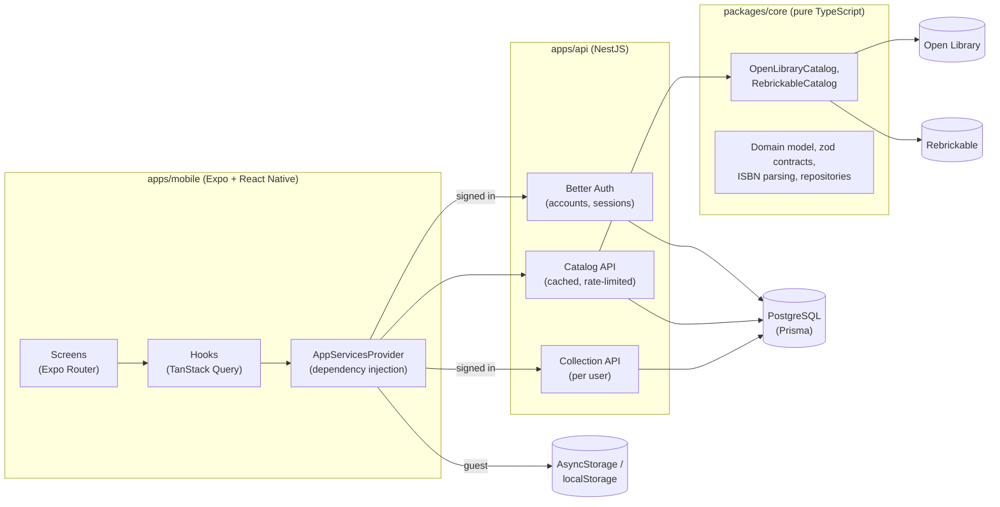

# Fandex

[](https://github.com/sbm2310/fandex/actions/workflows/ci.yml)

**Collect across formats — organized by universe and character.**

Fandex is a collection app for fans who collect comics, manga, fantasy books, premium figures and LEGO. Collector apps today are either single-category (LEGO-only, figures-only) or generic catalogers with blank fields. Fandex is built around how fans actually think about their shelves: _everything I own from Middle-earth, Batman or One Piece_, across every format.

<table>
  <tr>
    <td></td>
    <td></td>
    <td></td>
    <td></td>
  </tr>
  <tr>
    <td align="center">Collection</td>
    <td align="center">Search</td>
    <td align="center">Book detail</td>
    <td align="center">Sorted by title, light mode</td>
  </tr>
</table>

## Status: Stage 2 (v0.2.0)

**Live demo: [fandex-4mjc.onrender.com](https://fandex-4mjc.onrender.com)** (free hosting: the first visit after a quiet spell takes about a minute while the server wakes up). API docs: [/api/docs](https://fandex-4mjc.onrender.com/api/docs).

Fandex runs on iPhone and the web from one codebase, backed by its own API:

- **Accounts and cloud sync:** sign up with email and password; your collection follows you between iPhone and web. Without an account it's saved on the device, and signing in offers to move those items into the account.
- **Books, manga, comics and LEGO** in one collection, with category badges and filters. Books come from Open Library (category detected from publisher and subjects), LEGO sets from Rebrickable (search by name or set number, with pieces and theme).
- **Look up by ISBN** or **scan a barcode** with the iPhone camera. Typos are caught by the check digit before any request is made, and only book barcodes are accepted.
- **Your collection:** a cover grid sorted by recently added or by title (ignoring "The"/"A"), a detail screen per item, and removal with confirmation.
- **Account deletion** in the app (required by the App Store), light and dark mode, screen-reader labels, and browser tab titles on web.

Next up is the universe layer: franchise and character pages that link items across categories (see [Roadmap](#roadmap)).

## Architecture



- **`packages/core`** has no React, Node or platform code: the domain model, the zod schemas shared by the API and the app, ISBN validation, the Open Library and Rebrickable adapters, and the collection repository. Both the API and the app use it.
- **`apps/api`** is a NestJS API (in production it also serves the web app from the same origin). It owns the accounts (Better Auth, users stored in our PostgreSQL), caches catalog results in a shared `catalog_item` table, and stores each user's collection. A global guard protects every route unless it's marked public.
- **`apps/mobile`** is the Expo app. Screens get their dependencies (`BookCatalog`, `CollectionRepository`, `AccountService`) from a context provider: signed in, the collection is the API-backed repository; signed out, it's the on-device one. Tests swap in fakes.
- **Catalog entries vs. owned copies:** a catalog entry is what a catalog says exists; a `CollectionItem` is the user's copy, with a snapshot of the catalog data so the collection still renders if the source changes or is offline.

### Notable decisions

- **Open Library only.** It's free, keyless and allows browser calls. Google Books was evaluated and rejected: its terms forbid storing results permanently (which a collection does) and charging users without a separate agreement.
- **Cover images by cover ID**, not ISBN: Open Library rate-limits ISBN cover URLs (100 per 5 minutes per IP) but not cover-ID URLs.
- **Ownership is per edition** (matched by ISBN, else by source ID), because collectors care which printing they own.
- **One server, one origin:** the API serves the web app, so the web session cookie is first-party (no third-party cookie problems) and CORS only matters for development.
- **Users only see their own items:** every collection query is scoped by the signed-in user's id (never a request field), and another user's item answers 404 rather than 403. The tests for this were mutation-checked.
- **Defensive storage:** versioned JSON documents, serialized writes (rapid taps can't overwrite each other), and unreadable data raises an error instead of being silently replaced.

Full decision log: [`CLAUDE.md`](CLAUDE.md).

## Repository layout

```
apps/
  api/               NestJS API: accounts (Better Auth), cached catalog (books, manga, comics, LEGO), per-user collections, PostgreSQL via Prisma, OpenAPI docs
    prisma/          Database schema and migrations
    src/             Modules: auth, catalog, collection, health, me
    test/            End-to-end tests against a real test database
  mobile/            Expo app (Expo Router): iOS, Android and web
    src/app/         Routes: (tabs)/index, (tabs)/add, (tabs)/account, book/[id], scan
    src/components/  UI components
    src/hooks/       Data hooks (search, collection, account)
    src/services/    App services and their wiring (API clients, repositories)
packages/
  core/              Domain model, zod contracts, ISBN utilities, catalog adapters, repository
docs/plans/          Stage plans and task lists
docs/screenshots/    README images
render.yaml          Deployment (Render Blueprint)
```

## Getting started

Requirements: Node 24+ (see `.nvmrc`), npm, and [Docker Desktop](https://www.docker.com/products/docker-desktop/) for the local PostgreSQL database. For the iPhone, install [Expo Go](https://apps.apple.com/app/expo-go/id982107779).

```bash
npm install
cp apps/api/.env.example apps/api/.env     # then set BETTER_AUTH_SECRET (openssl rand -base64 32)
npm run db:up                              # start PostgreSQL in Docker
npm run db:deploy -w @fandex/api           # apply database migrations
npm run dev:api                            # API on http://localhost:3000, docs at /api/docs
```

In a second terminal:

```bash
npm run start -w @fandex/mobile
```

- **iPhone:** scan the QR code with the Camera app (phone and computer on the same Wi-Fi). The app finds the API on your computer automatically.
- **Web:** press `w` in the terminal.

To point the app at the deployed API instead of a local one:

```bash
EXPO_PUBLIC_API_URL=https://fandex-4mjc.onrender.com npm run start -w @fandex/mobile
```

### Publishing the iPhone app (no Mac needed to run it)

The iPhone app is published with [EAS Update](https://docs.expo.dev/eas-update/introduction/): Expo hosts the JavaScript bundle (with the deployed API URL built in), and Expo Go opens it without a dev server.

```bash
npm run update:ios -w @fandex/mobile    # publish the current code to the main branch
```

On the iPhone, sign in to Expo Go with the account that owns the project, then open **fandex → main** under Projects. Expo Go fetches new updates when the app is reopened. Expo's free plan covers this and can't incur charges.

LEGO search needs a free [Rebrickable API key](https://rebrickable.com/users/settings/#api) in `apps/api/.env` (`REBRICKABLE_API_KEY=...`); everything else works without it.

## Deployment

The API and the web app deploy together as one free [Render](https://render.com) web service, defined in [`render.yaml`](render.yaml), with a free [Neon](https://neon.com) PostgreSQL database. The API serves the exported web app from its own origin, so the browser's session cookie is first-party. Migrations run on every start, and every push to `main` redeploys. Secrets (database URL, Rebrickable key) live only in the Render dashboard; Render generates the session secret. On the free plan the service sleeps after 15 minutes without traffic and takes about a minute to wake.

## Testing

```bash
npm test            # all workspaces
npm run typecheck
npm run lint
npm run format:check
```

442 tests run in CI on every push:

- **`packages/core` (215, Jest + ts-jest):** ISBN validation against reference values, universe and character matching against recorded real data (including look-alikes such as a book about the "Star Wars" missile defense program and Norse mythology's Thor), book/manga/comic classification against real Open Library subject data, the Open Library and Rebrickable adapters against **recorded real API responses** plus edge cases, and the repository (concurrent writes, corrupt data, restarts) over an in-memory store.
- **`apps/api` (92, Vitest + Supertest):** config validation, caching and rate limiting, plus end-to-end tests against the real Nest app and a real PostgreSQL test database (created and migrated automatically), including sign-up/sign-in, native-app sessions, CORS, account deletion, password hashing, CSRF protection, the catalog API (validation, database caching, upstream failures) with a fake Open Library, the collection API, including isolation between users (mutation-checked), and storing and backfilling universe-matching signals (resumable after failures, without erasing LEGO minifigs).
- **`apps/mobile` (135, jest-expo + React Native Testing Library):** screens rendered with a fake catalog, a fake account service and the real repository over an in-memory store: search states, ISBN lookup, adding and removing, navigation, sorting, accounts (sign-in, sign-up, sign-out, delete account), cloud sync (account vs device collection, moving device books into an account), LEGO search and detail, category filters, and the barcode scanner with a mocked camera.

Tests never call the network.

## Concepts for .NET developers

This project was built by a C#/.NET developer learning React Native. If that's you too:

| Here                                     | Roughly like in .NET                                 |
| ---------------------------------------- | ---------------------------------------------------- |
| npm workspaces (`apps/*`, `packages/*`)  | A solution with several projects                     |
| `packages/core` consumed as source       | A class-library project reference                    |
| Expo Router (`src/app/` files = routes)  | Razor Pages file-based routing                       |
| `_layout.tsx`                            | `_Layout.cshtml`                                     |
| `AppServicesProvider` + `useCatalog()`   | Registering and resolving services in a DI container |
| TanStack Query                           | A cached `HttpClient` plus state management          |
| `foo.web.ts` next to `foo.ts`            | Conditional compilation per platform                 |
| Metro                                    | The bundler (like webpack)                           |
| EAS Build                                | A cloud CI service for native app binaries           |
| Expo Go                                  | A prebuilt host app that runs your JavaScript bundle |
| NestJS modules, controllers, providers   | ASP.NET Core controllers and DI registrations        |
| Global `AuthGuard` + `@AllowAnonymous()` | A fallback authorization policy + `[AllowAnonymous]` |
| Prisma schema + migrations               | EF Core model + migrations                           |
| zod schemas in `packages/core`           | Shared DTOs with validation attributes               |
| Vitest + Supertest e2e tests             | `WebApplicationFactory` integration tests            |

## Data sources and attribution

Book data and cover images come from [Open Library](https://openlibrary.org), a project of the Internet Archive. LEGO set data and images come from [Rebrickable](https://rebrickable.com). The universe and character list was drafted from [Wikidata](https://www.wikidata.org) (CC0). The native app identifies itself to the Open Library API (browsers can't set the header), Fandex caches responses, and only makes requests on behalf of a person, per their [API guidelines](https://openlibrary.org/developers/api).

## Roadmap

| Stage                    | Demo at the end                                                                 |
| ------------------------ | ------------------------------------------------------------------------------- |
| **1. MVP** ✅            | Add books by search, ISBN or barcode; collection with covers on iPhone and web  |
| **2. Real backend** ✅   | Accounts, cloud sync phone ↔ web, manga/comics/LEGO catalogs                    |
| 3. Universe layer        | Franchise and character pages linking items across categories                   |
| 4. AI                    | Shelf photo → identified items; natural-language questions about the collection |
| 5. Pre-orders & releases | Release dates, payment reminders, push notifications                            |
| 6. Launch                | TestFlight → App Store, shareable public collection pages                       |

## License

All rights reserved. The source is public for review; no license to reuse it is granted.
